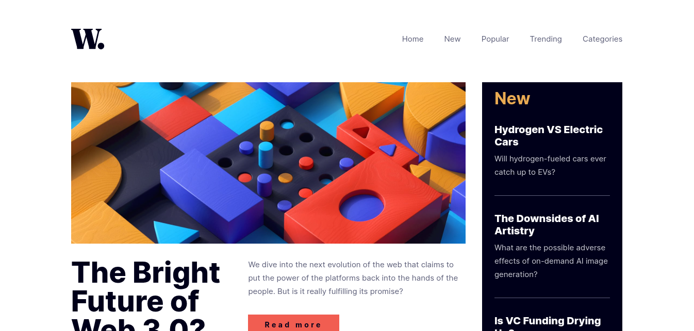

# Frontend Mentor - News homepage solution

This is a solution to the [News homepage challenge on Frontend Mentor](https://www.frontendmentor.io/challenges/news-homepage-H6SWTa1MFl). Frontend Mentor challenges help you improve your coding skills by building realistic projects.

## Table of contents

- [Overview](#overview)
  - [The challenge](#the-challenge)
  - [Screenshot](#screenshot)
  - [Links](#links)
- [My process](#my-process)
  - [Built with](#built-with)
  - [Design and architecture](#design-and-architecture)
- [Author](#author)

## Overview

### The challenge

Users should be able to:

- View the optimal layout for the interface depending on their device's screen size
- See hover and focus states for all interactive elements on the page

### Screenshot

### Links

- Solution URL: [https://github.com/vibesprint/news-homepage](https://github.com/vibesprint/news-homepage)
- Live Site URL: [https://vibesprint.github.io/news-homepage](https://vibesprint.github.io/news-homepage)

## My process

### Built with

- Semantic HTML5 markup
- CSS custom properties
- Flexbox
- Mobile-first workflow
- Sass CSS

### Design and architecture

CSS components are in sass/components directory. A component conceptually is not required to set the font and color of its content,
neither should it set the background color of its own. Those styles should be set by the user. Neither should the component
make any assumption of the context in which it would be used. Components has been designed using these principles in mind. Components
only set the paddings and layout for its children.

Components has been used in index.html and styled with fonts and colors in sass/styles.scss. In index.html, specific regions which can
be uniquely identified have been given an id, and they have been styled in CSS using their id.

The page has been designed using Mobile-first workflow. So you will see in the commits, that extra nesting was required while
moving to the larger screen breakpoints.

## Author
- Github - [https://github.com/vibesprint](https://github.com/vibesprint)
